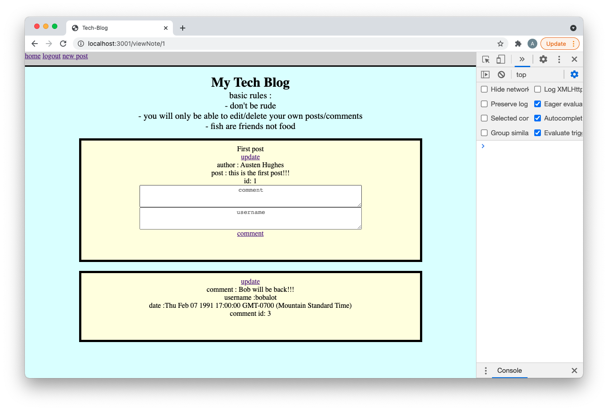

# tech-blog :

here you will find a basic blog. Built for sharing thoughts between friends across the web. Each user will have a log in and need to use it to access the site. any user can add posts or comments but they can only edit or delete their own posts or comments. It is hosted on heroku ... go check it out!!! 

## installations (to run locally) :

express : https://www.npmjs.com/package/express  
express sessions : https://www.npmjs.com/package/express-session  
mysql : https://www.mysql.com/  
mysql workbench : https://www.mysql.com/products/workbench/  

## directions :

to run locally start here :

    open your my sql workbench 
    copy the schema from db folder 
    run the schema 

    create a .env file containing
    DB_NAME=
    DB_PASSWORD=
    DB_USER=

    open your integrated terminal and run 
        npm i ( to install your node modules )
        npm run seed ( if you want the sample seed data )
        npm run start ( this will start your server )

    got to your preferred browser 
    run localhost:3001 
    here you will fin the blog!!!

To use the blog :

    - you will start at a login page

    - if you do not have have a user name and password you can use a nav item found in the up left corner to move to the make new user page

    - fill the fields and hit enter
    - use that username and password to login
    - you will now be brought to the home page

    - you will find a nav bar at the top with a few option : create post : home : logout ... you will always have this navbar
    - you will also find card in the middle with note tittles and some information so you cna select which note to view
    - if you select a note you will be taken to the note and its comments 

    - here you can choose to edit the note or leave a comment or edit a comment 
    - you will only be able to edit posts or comments that belong to you 
 
    - to leave a comment fill out the comment and user name box 
        - either can be left blank if you wish to post anonymously  
    - if you go to edit a post or comment you will take to their edit pages respectively 
    - these pages will present you with the text in a text box ready to be edited just update and click the update item 
    - you can also chose to delete the post at this time using the delete item 
    - posts and comments are automatically assigned to the user id of the person logged in and this can no be changed 

    -- to make a new post click on the new post item found in the upder left hand corner 
    - this will take you to page where you will be given text boxes to fill out
        - the will be for title author and post 
    -fill these out and hit submit

## recourses :

mysql workbench : https://www.mysql.com/products/workbench/  
w3schools : https://www.w3schools.com/  
mozilla : https://developer.mozilla.org/en-US/  
stackoverflow : https://stackoverflow.com/  
mysql : https://www.mysql.com/  
express : https://www.npmjs.com/package/express  
express sessions : https://www.npmjs.com/package/express-session  

## github :

github : https://github.com/austenhughes/tech-blog

<!-- ## heroku :  -->

## contact me at :

Email : austen.hughes.91@gmail.com  
github : https://github.com/austenhughes  